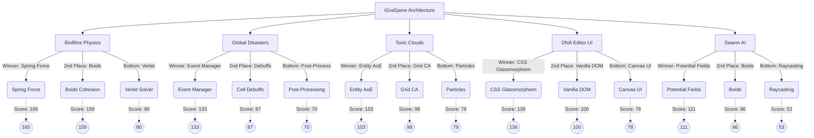

# Дерево Архитектурных Решений (Decision Tree)

```mermaid
graph TD
    Root[iGraSpore Architecture] --> T1[Biofilms Physics]
    
    T1 -->|Winner: Spring Force| W1(Spring Force)
    W1 -.->|Score: 165| W1S((165))
    
    T1 -->|2nd Place: Boids| L1(Boids Cohesion)
    L1 -.->|Score: 159| L1S((159))
    
    T1 -->|Bottom: Verlet| B1(Verlet Solver)
    B1 -.->|Score: 80| B1S((80))
    
    Root --> T2[Global Disasters]
    
    T2 -->|Winner: Event Manager| W2(Event Manager)
    W2 -.->|Score: 133| W2S((133))
    
    T2 -->|2nd Place: Debuffs| L2(Cell Debuffs)
    L2 -.->|Score: 87| L2S((87))
    
    T2 -->|Bottom: Post-Process| B2(Post-Processing)
    B2 -.->|Score: 70| B2S((70))
    
    Root --> T3[Toxic Clouds]
    
    T3 -->|Winner: Entity AoE| W3(Entity AoE)
    W3 -.->|Score: 103| W3S((103))
    
    T3 -->|2nd Place: Grid CA| L3(Grid CA)
    L3 -.->|Score: 98| L3S((98))
    
    T3 -->|Bottom: Particles| B3(Particles)
    B3 -.->|Score: 79| B3S((79))
    
    Root --> T4[DNA Editor UI]
    
    T4 -->|Winner: CSS Glassmorphism| W4(CSS Glassmorphism)
    W4 -.->|Score: 136| W4S((136))
    
    T4 -->|2nd Place: Vanilla DOM| L4(Vanilla DOM)
    L4 -.->|Score: 100| L4S((100))
    
    T4 -->|Bottom: Canvas UI| B4(Canvas UI)
    B4 -.->|Score: 78| B4S((78))
    
    Root --> T5[Swarm AI]
    
    T5 -->|Winner: Potential Fields| W5(Potential Fields)
    W5 -.->|Score: 111| W5S((111))
    
    T5 -->|2nd Place: Boids| L5(Boids)
    L5 -.->|Score: 86| L5S((86))
    
    T5 -->|Bottom: Raycasting| B5(Raycasting)
    B5 -.->|Score: 53| B5S((53))
```
